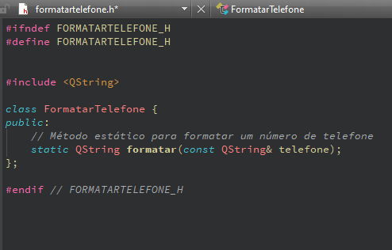
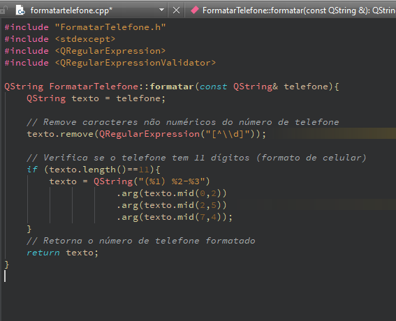

```markdown
# Formatar Telefone

Esta classe fornece uma maneira simples de formatar números de telefone no formato brasileiro.

## Uso

Para usar a classe `FormatarTelefone`, siga estas etapas:

1. **Incluir o arquivo de cabeçalho:**

   ```cpp
   #include "FormatarTelefone.h"
   ```

2. **Chamar o método `formatar`:**

   ```cpp
   QString telefone = FormatarTelefone::formatar("12345678901");
   ```

   Isso irá retornar o número de telefone no formato "(12) 34567-8901".

## Exemplo de Uso

```cpp
#include "FormatarTelefone.h"

// ...
QString telefoneFormatado = FormatarTelefone::formatar("12345678901");
```

Isso é tudo! Agora você pode usar a classe `FormatarTelefone` para formatar números de telefone em seu aplicativo.

## Contribuição

Contribuições são bem-vindas! Sinta-se à vontade para abrir uma issue ou enviar um pull request para melhorar este projeto.

## Visualização final

## Licença

Este projeto está licenciado sob a [MIT License](LICENSE).
```

